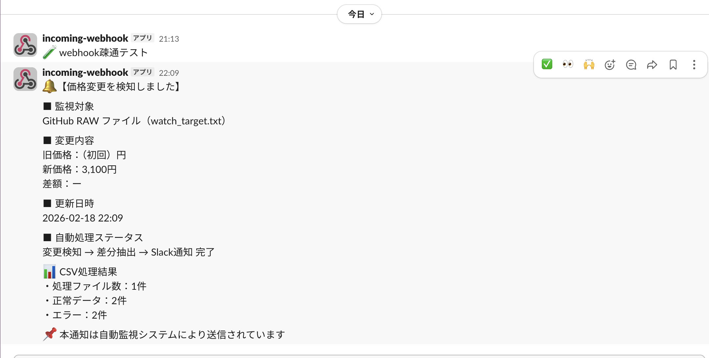

# 🔔 Web Price Monitor & Slack Automation

価格確認作業を自動化し、
変更時のみSlackへ通知する実務想定の監視ツールです。

---

## 🎯 できること

- Webページ価格の自動検知
- GitHub RAWファイル監視
- 前回値との差額算出（+◯◯円表示）
- 変更時のみSlack通知
- CSV正規化・集計・エラー抽出

---

## 📨 Slack通知イメージ

<p align="center">
  
</p>

---

## 🛠 技術スタック

- Python 3.11+
- requests
- pyyaml
- Slack Incoming Webhooks

---

## 🚀 Cursorでの起動方法

```bash
python -m venv .venv
source .venv/bin/activate
pip install -r requirements.txt
cp config.example.yaml config.yaml

---

## 💼 想定活用シーン

- EC価格監視
- 競合価格チェック
- 在庫更新監視
- 業務効率化の自動化案件

---

## 🔐 セキュリティ

- WebhookはGit管理外（config.yamlはignore済）